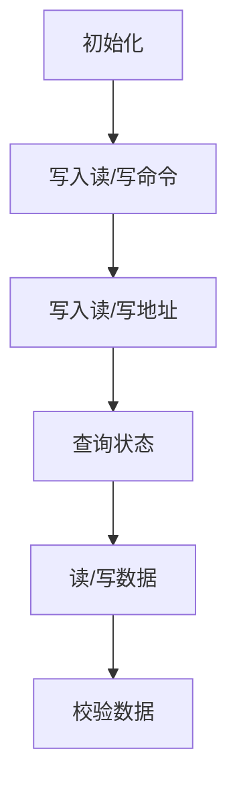

# 2 嵌入式系统硬件平台

## 2.1 嵌入式系统硬件平台概述

### 2.1.1 整体构架

#### 台式计算机硬件平台整体构架

#### 嵌入式系统硬件平台整体构架

##### 作业：看门狗和实时时钟是什么？

###### 看门狗（Watchdog）

**我的理解**：

- 概念：看门狗实际上就是一个计时器，用来确保系统能在出现问题时可以自行恢复，恢复的方式包括但不限于：

    1. 将系统置到安全状态，重置系统操作
    2. 芯片级别的重置

- 功能：仅仅是一种可能的情况，系统在执行正常操作时会不断重置看门狗计时器，当系统出现问题时，不能重置看门狗计时器，计时器会在超时后发出超时信号，使系统自动恢复

> - [WikiPedia](https://en.wikipedia.org/wiki/Watchdog_timer)：A **watchdog timer** (sometimes called a *computer operating properly* or *COP* timer, or simply a *watchdog*) is an electronic or software [timer](https://en.wikipedia.org/wiki/Timer) that is used to **detect and recover from computer malfunctions**. During normal operation, the computer regularly resets the watchdog timer to prevent it from elapsing, or "timing out". If, due to a hardware fault or program error, the computer **fails to reset the watchdog**, the timer will **elapse and generate a timeout signal**. The timeout signal is used to initiate corrective actions. The corrective actions typically include placing the computer system in a safe state and restoring normal system operation.
>
> - [Gateworks](http://trac.gateworks.com/wiki/watchdog)：Gateworks boards provide both a hardware boot watchdog timer that power cycles the board if boot firmware failed to run as well as SoC watchdogs.
>
>     - **Ventana (imx6) CPU watchdog**：The IMX6 SoC watchdog has an 8bit timeout configuration ranging from 500ms to 128s in 500ms intervals and will issue a **chip-level SoC reset**. On some boards an external output can also be present to reset other peripherals(外围设备).

###### 实时时钟（RTC，Real Time Clock）

**我的理解**：

- 概念：顾名思义，就是记录当前时间的时钟，通常是集成芯片的形态，与只会产生时钟信号的硬件时钟（hardware clocks）不同，实时时钟按照人类的计时方式计时
- 功能：持续跟踪记录实时时间

> - [WikiPedia](https://en.wikipedia.org/wiki/Real-time_clock)：A **real-time clock** (**RTC**) is a [computer](https://en.wikipedia.org/wiki/Computer) [clock](https://en.wikipedia.org/wiki/Clock) (most often in the form of an [integrated circuit](https://en.wikipedia.org/wiki/Integrated_circuit)) that keeps track of the current [time](https://en.wikipedia.org/wiki/Time). Although the term often refers to the devices in [personal computers](https://en.wikipedia.org/wiki/Personal_computer), [servers](https://en.wikipedia.org/wiki/Server_(computing)) and [embedded systems](https://en.wikipedia.org/wiki/Embedded_system), RTCs are present in almost any electronic device which needs to keep accurate time.
>
>     **Purpose**：
>
>     - Low power consumption (important when running from alternate power)
>     - Frees the main system for time-critical tasks
>     - Sometimes more accurate than other methods

### 2.1.2 两类嵌入式主机板

#### 一体式主机板

1. 一体式主机板会裁剪掉实际应用中不需要使用的多余功能，形成**一个整体**，嵌入到设备中使用
2. **有固定的功能和应用领域**，更具专用性，一般**不需要**再改变
3. 适合在**有一定批量和通用性**的嵌入式产品中使用，如PMD主机板就是这种类型的代表

#### 核心式主机板

1. 只包含核心硬件，相当于基于嵌入式处理器的最小系统，使用时**通过外围板扩展功能**
2. 实际嵌入到设备时，在核心板不变的请况下，通过**搭配不同外围板实现嵌入式系统的不同应用需求**
3. 适用于**需要二次开发的场合**，与主机板配套的外围板可以**由厂家提供**，也可**自行开发**
4. 印制板一般为6～10层板，尺寸为**名片大小**，总线通过**外部接口引出**
5. 完成了嵌入式计算机系统中设计和布线最复杂的部分，**大大简化了外围板的设计难度**
6. 除了包含嵌入式处理器外，一般还配有内存、电子盘、常用设备和总线接口

### 2.1.3 编程模式

#### 片内接口

1. 片内接口的编程通过操作嵌入式处理器内部一组**特殊寄存器**完成，本课程称为`特殊功能寄存器SFR`（三星处理器约定称谓）
2. 片内接口的使用按照嵌入式处理器规定好的方式进行，其使用可参见**嵌入式处理器**的数据手册

#### 片外接口

1. 外部接口则与外部总线相连，通过端口进行操作
2. 片外接口使用方式按照**外部接口**采用的接口芯片或电路进行

### 2.1.4 可配置的引脚

#### 引脚的复用

1. 嵌入式处理器内部提供了大量的I/O接口，每种I/O接口都有自己独立的引脚同外部设备连接
2. 这会引起外部引脚数量的大量增加，从而增大处理器芯片的体积
3. 嵌入式处理器采用复用引脚，即**一脚多用**的方法来解决这个问题
4. 这样，每个引脚都有多个功能，只在**需要时才配置成对应功能**

##### 引脚复用的例子

1. S3C2410处理器每个引脚最多可以复用4个功能
2. IMX6处理器每个引脚最多可以复用8个功能

#### GPIO引脚

1. 最简单的外设就是开关量装置，所以通常嵌入式系统中可配置的复用引脚功能中至少都包含有**通用目的的输入输出(GPIO)**
2. 这种引脚被称为GPIO引脚，在不需要设置为其它专用外设引脚的时候，至少可以配置为使用量最大的输入和输出功能，以利于充分利用引脚资源

## 2.2 基于IMX6的最小系统

### 2.2.1 IMX6处理器

#### 基本介绍

1. 运行频率高达1.2GHz，包括单核、双核、四核产品
2. 内部含有32KB的一级指令和数据缓存、256KB到1MB的二级缓存
3. 支持1080P60解码、1080P30编码和高清视频播放，出色的3D图形性能支持OpenCL
4. 96K启动ROM、16K加密RAM、128个GPIO口
5. 独立2D/3D加速引擎，支持立体图像传感器3D成像，支持高仿真3D游戏
6. 集成HDMI、SD、USB 2.0、千兆以太网、SATA、PCIe、MIPI及FlexCAN
7. 全面的安全功能，包括密码算法加速器、高可靠性引导程序和防篡改保护
8. 可选的集成EPD显示器控制器，用于电子阅读器和类似应用（营造纸张的感觉）
9. 高性能的主动式电源管理

#### 处理器平台

1. 内核Cortex-A9
2. 每个核32K指令Cache（I Cache）
3. 每个核32K数据Cache（D Cache）
4. 每个核128位SIMD扩展结构
5. 每个核的程序跟踪宏单元（调试用）
6. 256k-1M二级cache

#### 内部接口

1. MMC/SD卡接口
2. 异步串行口
3. IIC及SPI接口
4. 串行音频接口
5. 3.3v GPIO
6. 矩阵键盘接口
7. SATA接口
8. USB相关接口1
9. USB相关接口2
10. MIPI高速同步串行接口
11. S/PDIF数字音频接口
12. PCIe高步串行总线接口
13. FlexCAN总线接口
14. 1Gb以太网接口
15. NandFlash控制器接口
16. DDR内存芯片接口

#### 多媒体及显示

1. 硬件图形加速器
    1. 3D及2D支持
    2. 矢量图形支持
2. 视频编解码支持
3. 音频支持
4. 图像处理单元
    1. 调整大小与合成
    2. 图像增强
    3. 反转与旋转
5. 显示及摄像头接口
    1. HDMI接口
    2. MIPI接口
    3. LVDS显示接口
    4. 摄像头接口
    5. EPDC显示接口

#### 系统控制及其它

1. 系统控制
    1. JTAG调试口
    2. 锁相环，晶振：矩形波的来源
    3. 时钟及复位
    4. DMA接口
    5. IO多路选择
    6. PWM
    7. 看门狗
2. 电源管理
    1. 电源供给
    2. 温度监控
3. 内部存储器
4. 安全支持
    1. 随机数发生器
    2. 安全控制器
    3. 可信区
    4. 实时时钟
    5. 密码
    6. 3840位一次性ROM

#### 引脚信号

有25 * 25 - 1 = 624个引脚，去除了一个引脚，因为该引脚不方便插入

**9月21日**

***

### 2.2.2 主存储器

#### 给出一个实际的IMX6与存储芯片的连接：

采用四片MT41K128M16JT DDR3存储芯片作为系统的内存，单片容量为8bank×128M×16bit，**14位行地址和13位列地址**输入，内存总容量为2GB*4=8GB

1. 8bank：8个卡槽
2. 128M：27根地址线
3. 16bit：16跟数据线

#### 电路示意图

1. SDRAM时钟：因为存储器是DRAM，刷新时需要使用时钟

### 2.2.3 辅助存储器

#### 两种非易失性存储器：Flash和EEPROM

1. Flash容量大于EEPROM
2. 二者的主要区别表现在读写特性上
    1. Flash在**写入之前，必须要经过擦除(erase)操作**，而且擦除只能**以块(block)为单位，整块擦除**，即使要修改一个字节的数据，也需要擦除整个块的内容
    2. EEPROM可以**逐字节修改**

#### NandFlash和NorFlash

| NandFlash                                                    | NorFlash                                                     |
| ------------------------------------------------------------ | ------------------------------------------------------------ |
| 擦除时数据变为0xFF，**写入时只能由1变0**                     | 擦除时数据变为0x00，**写入时只能由0变1**                     |
| 读速度不如Nor flash，而擦、写速度高，容量大，价格低，有取代磁盘的趋势 | 读速度高，而擦、写速度低，容量小，价格高                     |
| 使用地址和数据引脚构成通用的I/O口，**通过多次寻址存取数据**，其读和写操作以512(或者2K)字节的页(page)为单位 | **接口时序与SRAM一样**，其地址、数据及读写控制引脚能与CPU的三总线直接连接，就可以很容易地存取其内部的每一个字节 |
| 有**单独时序**，**不可在其上直接**运行代码                   | **可在其上直接**运行代码，使用简单                           |
| 块的最大擦写次数是**一百万次甚至千万次**                     | 而Nor的擦写次数是**十万次数量级**                            |
| 发生**位交换错误的次数多**，需要使用ECC校验算法 ，需要初始化扫描，标记坏块 | 位交换发生次数远远少于NandFlash                              |

#### NandFlash芯片引脚

- 命令锁存引脚CLE
- 芯片写引脚nWE
- 地址锁存引脚ALE
- 芯片读引脚nRE
- 芯片使能引脚nCE
- 就绪/忙引脚R/nB
- 数据/命令/地址输入输出引脚I/O0~I/O7

使用流程：

#### eMMC

### 2.2.4 时钟&电源

## 2.3 IMX6内部接口

### 2.3.1 GPIO

GPIO：通用目的的输入输出，泛指处理器中可作为开关量使用的输入输出引脚

> 第一个驱动程序实验：利用GPIO控制led灯的亮灭

### 2.3.2 PWM

PWM：脉宽调制，主要是为了实现**数字信号向模拟信号的转换**

#### 基本介绍

#### IMX6 PWM的主要特性

- 占位
- 占位
- 12位预分频器——可以变更时钟源
- 占位

### 2.3.3 UART

UART：异步串行口

BPS：波特率

### 2.3.4 USB

### 2.3.5 显示及摄像头接口

### 2.3.6 SD

### 2.3.7 IIC

### 2.3.8 音频支持

### 2.3.9 SPI

