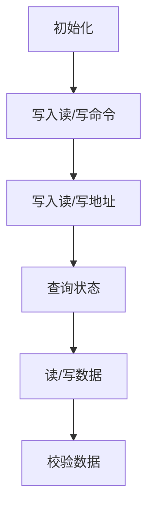

# 2 嵌入式系统硬件平台

## 2.1 嵌入式系统硬件平台概述

### 2.1.1 整体构架

#### 台式计算机硬件平台整体构架

#### 嵌入式系统硬件平台整体构架

##### 作业：看门狗和实时时钟是什么？

###### 看门狗（Watchdog）

**我的理解**：

- 概念：看门狗实际上就是一个计时器，用来确保系统能在出现问题时可以自行恢复，恢复的方式包括但不限于：

    1. 将系统置到安全状态，重置系统操作
    2. 芯片级别的重置

- 功能：仅仅是一种可能的情况，系统在执行正常操作时会不断重置看门狗计时器，当系统出现问题时，不能重置看门狗计时器，计时器会在超时后发出超时信号，使系统自动恢复

> - [WikiPedia](https://en.wikipedia.org/wiki/Watchdog_timer)：A **watchdog timer** (sometimes called a *computer operating properly* or *COP* timer, or simply a *watchdog*) is an electronic or software [timer](https://en.wikipedia.org/wiki/Timer) that is used to **detect and recover from computer malfunctions**. During normal operation, the computer regularly resets the watchdog timer to prevent it from elapsing, or "timing out". If, due to a hardware fault or program error, the computer **fails to reset the watchdog**, the timer will **elapse and generate a timeout signal**. The timeout signal is used to initiate corrective actions. The corrective actions typically include placing the computer system in a safe state and restoring normal system operation.
>
> - [Gateworks](http://trac.gateworks.com/wiki/watchdog)：Gateworks boards provide both a hardware boot watchdog timer that power cycles the board if boot firmware failed to run as well as SoC watchdogs.
>
>     - **Ventana (imx6) CPU watchdog**：The IMX6 SoC watchdog has an 8bit timeout configuration ranging from 500ms to 128s in 500ms intervals and will issue a **chip-level SoC reset**. On some boards an external output can also be present to reset other peripherals(外围设备).

###### 实时时钟（RTC，Real Time Clock）

**我的理解**：

- 概念：顾名思义，就是记录当前时间的时钟，通常是集成芯片的形态，与只会产生时钟信号的硬件时钟（hardware clocks）不同，实时时钟按照人类的计时方式计时
- 功能：持续跟踪记录实时时间

> - [WikiPedia](https://en.wikipedia.org/wiki/Real-time_clock)：A **real-time clock** (**RTC**) is a [computer](https://en.wikipedia.org/wiki/Computer) [clock](https://en.wikipedia.org/wiki/Clock) (most often in the form of an [integrated circuit](https://en.wikipedia.org/wiki/Integrated_circuit)) that keeps track of the current [time](https://en.wikipedia.org/wiki/Time). Although the term often refers to the devices in [personal computers](https://en.wikipedia.org/wiki/Personal_computer), [servers](https://en.wikipedia.org/wiki/Server_(computing)) and [embedded systems](https://en.wikipedia.org/wiki/Embedded_system), RTCs are present in almost any electronic device which needs to keep accurate time.
>
>     **Purpose**：
>
>     - Low power consumption (important when running from alternate power)
>     - Frees the main system for time-critical tasks
>     - Sometimes more accurate than other methods

#### 嵌入式系统与台式计算机硬件平台整体构架的比较

- 嵌入式处理器内部有了独立的嵌入式处理器内核，有了一些**被称为“控制器的”I/O接口**
- 在处理器内部，这些部件通过内部总线连接起来，就象计算机系统一样，这正是片上系统SOC含义所在
- 由于其中每个部件都是一个独立的IP核，也清楚地说明了SOC是基于IP核技术的
- 由于嵌入式处理器内部提供了常用的I/O接口，**很多外部I/O设备就可以直接与处理器相连了**
    - 这样就形成了“处理器+外设”的嵌入式系统的硬件结构
    - 一方面，这种方式简化了系统的构建，降低了硬件设计工作量
    - 另一方面，这种结构伸缩性强，正好可以适应嵌入式系统领域应用的多样性

### 2.1.2 两类嵌入式主机板

#### 概念引入

1. 主机板(Mainboard 或 Systemboard)通常指**台式计算机中把各部件连接到一起的印刷电路板**
    1. 台式计算机的**主板**上通常留有 CPU、内存、硬盘及输入输出设备插座，是个人计算机的一大部件
2. 对于**嵌入式系统**，其**主机板通常就是不含外设的嵌入式系统**
    1. 嵌入式处理器、NandFlash和内存通常都**直接作为主机板的一部分**，只留有与外部 I/O 设备的接口
    2. 嵌入式主机板通常是**能构成完整计算机系统的不可分割一块线路板**
    3. 分为两种主要类型：**一体式主机板**和**核心式主机板**

#### 一体式主机板

1. 一体式主机板会**裁剪掉实际应用中不需要使用的多余功能**，形成**一个整体**，嵌入到设备中使用
2. **有固定的功能和应用领域**，更具**专用性**，**一般不需要再改变**
3. 适合在**有一定批量和通用性**的嵌入式产品中使用，如PMD主机板就是这种类型的代表

#### 核心式主机板

1. 只包含核心硬件，**相当于基于嵌入式处理器的最小系统**，使用时**通过外围板扩展功能**
2. 实际嵌入到设备时，在核心板不变的请况下，通过**搭配不同外围板实现嵌入式系统的不同应用需求**
3. 适用于**需要二次开发的场合**，与主机板配套的外围板可以**由厂家提供**，也可**自行开发**
4. 印制板**一般为6～10层板**，尺寸为**名片大小**，总线通过**外部接口引出**
5. 完成了嵌入式计算机系统中设计和布线最复杂的部分，**大大简化了外围板的设计难度**
6. 除了包含嵌入式处理器外，一般还配有内存、电子盘、常用设备和总线接口

### 2.1.3 编程模式

#### 片内接口

1. 片内接口的编程通过操作嵌入式处理器内部一组**特殊寄存器**完成，本课程称为`特殊功能寄存器SFR`（三星处理器约定称谓）
2. 片内接口的使用按照嵌入式处理器规定好的方式进行，其使用可参见**嵌入式处理器**的数据手册

#### 片外接口

1. 外部接口则与外部总线相连，通过端口进行操作
2. 片外接口使用方式按照**外部接口**采用的接口芯片或电路进行

### 2.1.4 可配置的引脚

#### 引脚的复用

1. 嵌入式处理器内部提供了大量的I/O接口，每种I/O接口都有自己独立的引脚同外部设备连接
2. 这会引起外部引脚数量的大量增加，从而增大处理器芯片的体积
3. 嵌入式处理器采用复用引脚，即**一脚多用**的方法来解决这个问题
4. 这样，每个引脚都有多个功能，只在**需要时才配置成对应功能**

##### 引脚复用的例子

1. S3C2410处理器**每个引脚最多可以复用4个功能**
2. IMX6处理器**每个引脚最多可以复用8个功能**

#### GPIO引脚

GPIO，General Purpose IO

1. 最简单的外设就是开关量装置，所以通常嵌入式系统中可配置的复用引脚功能中至少都包含有**通用目的的输入输出(GPIO)**
2. 这种引脚被称为GPIO引脚，在不需要设置为其它专用外设引脚的时候，至少可以配置为使用量最大的输入和输出功能，以利于充分利用引脚资源

## 2.2 基于IMX6的最小系统

### 2.2.1 IMX6处理器

#### 基本介绍

1. 运行频率高达1.2GHz，包括单核、双核、四核产品
2. 内部含有32KB的一级指令和数据缓存、256KB到1MB的二级缓存
3. 支持1080P60解码、1080P30编码和高清视频播放，出色的3D图形性能支持OpenCL
4. 96K启动ROM、16K加密RAM、**128个GPIO口**
5. 独立2D/3D加速引擎，支持立体图像传感器3D成像，支持高仿真3D游戏
6. 集成HDMI、SD、USB 2.0、千兆以太网、SATA、PCIe、MIPI及FlexCAN
7. 全面的安全功能，包括密码算法加速器、高可靠性引导程序和防篡改保护
8. 可选的集成EPD显示器控制器，用于电子阅读器和类似应用（可用于营造纸张的感觉）
9. 高性能的主动式电源管理

#### 处理器平台

1. 内核Cortex-A9
2. 每个核32K指令Cache（I Cache）
3. 每个核32K数据Cache（D Cache）
4. 每个核128位SIMD扩展结构
5. 每个核的程序跟踪宏单元（调试用）
6. 256k-1M二级cache

#### 内部接口

1. MMC/SD卡接口
2. 异步串行口
3. IIC及SPI接口
4. 串行音频接口
5. 3.3v GPIO
6. 矩阵键盘接口
7. SATA接口
8. USB相关接口1
9. USB相关接口2
10. MIPI高速同步串行接口
11. S/PDIF数字音频接口
12. PCIe高步串行总线接口
13. FlexCAN总线接口
14. 1Gb以太网接口
15. NandFlash控制器接口
16. DDR内存芯片接口

#### 多媒体及显示

1. 硬件图形加速器
    1. 3D及2D支持
    2. 矢量图形支持
2. 视频编解码支持
3. 音频支持
4. 图像处理单元
    1. 调整大小与合成
    2. 图像增强
    3. 反转与旋转
5. 显示及摄像头接口
    1. HDMI接口
    2. MIPI接口
    3. LVDS显示接口
    4. 摄像头接口
    5. EPDC显示接口

#### 系统控制及其它

1. 系统控制
    1. JTAG调试口
    2. 锁相环，晶振：矩形波的来源
    3. 时钟及复位
    4. DMA接口
    5. IO多路选择
    6. PWM
    7. 看门狗
2. 电源管理
    1. 电源供给
    2. 温度监控
3. 内部存储器
4. 安全支持
    1. 随机数发生器
    2. 安全控制器
    3. 可信区
    4. 实时时钟
    5. 密码
    6. 3840位一次性ROM

#### 引脚信号

有25 * 25 - 1 = 624个引脚，如下图所示，左下角的引脚被去除了，因为该引脚不方便插入

**9月21日**

***

### 2.2.2 主存储器

#### 给出一个实际的IMX6与存储芯片的连接：

采用四片MT41K128M16JT DDR3存储芯片作为系统的内存，单片容量为8bank×128M×16bit，**14位行地址和13位列地址**输入，内存总容量为2GB*4=8GB

1. 8bank：8个卡槽
2. 128M：27根地址线
3. 16bit：16跟数据线

#### 电路示意图

1. SDRAM时钟：因为存储器是DRAM，刷新时需要使用时钟

### 2.2.3 辅助存储器

#### 两种非易失性存储器：Flash和EEPROM

1. Flash容量大于EEPROM
2. 二者的主要区别表现在读写特性上
    1. Flash在**写入之前，必须要经过擦除(erase)操作**，而且擦除只能**以块(block)为单位，整块擦除**，即使要修改一个字节的数据，也需要擦除整个块的内容
    2. EEPROM可以**逐字节修改**

#### NandFlash和NorFlash

对擦除时的理解，我认为是擦除操作完成后，尚未进行数据写入操作

| NandFlash                                                    | NorFlash                                                     |
| ------------------------------------------------------------ | ------------------------------------------------------------ |
| 擦除时数据变为0xFF，**写入时只能由1变0**                     | 擦除时数据变为0x00，**写入时只能由0变1**                     |
| 读速度不如Nor flash，而擦、写速度高，容量大，价格低，有取代磁盘的趋势 | 读速度高，而擦、写速度低，容量小，价格高                     |
| 使用地址和数据引脚构成通用的I/O口，**通过多次寻址存取数据**，其读和写操作以512(或者2K)字节的页(page)为单位 | **接口时序与SRAM一样**，其地址、数据及读写控制引脚能与CPU的三总线直接连接，就可以很容易地存取其内部的每一个字节 |
| 有**单独时序**，**不可在其上直接**运行代码                   | **可在其上直接**运行代码，使用简单                           |
| 块的最大擦写次数是**一百万次甚至千万次**                     | 而Nor的擦写次数是**十万次数量级**                            |
| 发生**位交换错误的次数多**，需要使用ECC校验算法 ，需要初始化扫描，标记坏块 | 位交换发生次数远远少于NandFlash                              |

#### NandFlash芯片引脚

- 命令锁存引脚CLE
- 芯片写引脚nWE
- 地址锁存引脚ALE
- 芯片读引脚nRE
- 芯片使能引脚nCE
- 就绪/忙引脚R/nB
- 数据/命令/地址输入输出引脚I/O0~I/O7

使用流程：

#### eMMC

eMMC，Embedded Multi Media Card

- eMMC在封装中集成了一个控制器，提供标准接口并管理闪存
- eMMC就是NandFlash+主控IC，对外提供的接口协议与SD、TF卡类似，简化了电路设计，容量大，成本低
- eMMC主要厂家有台湾的Phison、SMI，大陆的SiliconGo

### 2.2.4 时钟&电源

电源转换，晶振时钟，详见PPT2.2 P21-P24

## 2.3 IMX6内部接口

### 2.3.1 GPIO

- GPIO：通用目的的输入输出，泛指处理器中可作为开关量使用的输入输出引脚

- IMX6有大量的复用引脚，**每个引脚最多可配置成8种不同的功能**，其中就**包括GPIO功能**

- 设置成GPIO引脚后，就可以通过编程进行操作了，以后要完成的驱动程序实验就利用GPIO控制led灯的亮灭

    > 第一个驱动程序实验：利用GPIO控制led灯的亮灭

- IMX6处理器共有128个GPIO引脚

### 2.3.2 PWM

PWM，脉宽调制

- PWM是指对一个方波序列信号的**占空比**按照要求进行调制，**而不改变信号的幅度和周期**，因此脉宽调制信号是数字式的
- 如果调制信号的频率远远大于信号接受者的分辨率，则接收者获得的是信号的平均效果，因此**模拟信号可以使用PWM实现**
- PWM技术应用在测量、通信到功率控制与变换的许多领域中
- 基于PWM的特点，可以利用PWM实现**数字信号向模拟信号的转换**

#### 基本介绍

#### IMX6 PWM的主要特性

- 4个带时钟源选择的16位递增计数器（加法计数器）
- 4x16 FIFO，最大限度地减少中断开销
- 12位预分频器——可以变更时钟源
- 声音和旋律生成
- 可配置的占空比
- 可编程为在低功率模式下激活
- 可编程为在调试模式下激活
- 支持中断

### 2.3.3 UART

UART：异步串行口

BPS：波特率，115200

我们的IMX6实验平台有四个RS232串口，但是只有3个可用，第四个没有相应的硬件插口（**IMX6处理器最多可配置成5个串口**）

#### UART串行通信引脚

- TXD：发送数据引脚
- RXD：接受数据引脚
- 最简单的串行通信除了共同的地线外，只需要上述这2个引脚
- 如果需要握手，则需要流控信号：
    - nRTS：请求对方发送
    - nCTS：清除请求发送

#### 数据帧格式

- 串行通信双方按照约定好的数据帧进行通信
- 数据帧包含
    - **1个开始位**
    - **5到8个数据位**
    - **1个可选的奇偶校验位**
    - **1个或2个停止位**
- 常设置成8N1，即8数据位，无奇偶校验位，1停止位

9月23日

***

### 2.3.4 USB

- USB：`Universal Serial Bus`，即通用串行总线，是**应用最广泛的外设接口规范**

- USB接口支持**即插即用**，可以从系统中直接汲取电流，**无需单独供电**，使用非常方便

- USB规范主要有三种

    1. USB1.1：最高12Mb/s
    2. USB2.0：最高480Mb/s
    3. USB3.0：最高5Gb/s

    IMX6支持`USB2.0`

- 按照物理接口，USB分为

    1. 主机，HOST
    2. 设备，DEVICE
    3. 集线器，HUB

- 一个完整的USB拓扑，只有一个主机，可以连接**127**个设备, 既可以使用**菊花链形式串行连接**，也可以使用**集线器连接**

- IMX6的USB引脚电路图

    

- 一些基于USB的设备

    

- 越来越多的台式机不再配有串口，而很多时候目标机的标准输出设备都是串口，这时我们可以**使用外接的USB转串口线，或者在目标板上设计USB转串口的电路**

### 2.3.5 显示及摄像头接口

- 嵌入式系统的显示设备**以LCD液晶屏为主**，**显卡通常就是LCD控制器**
- IMX6处理器中
    - 显示接口包括`HDMI、LVDS、MIPI及EPDC(e-ink电子墨水屏接口)`
    - 摄像头接口为`20位CSI`

#### LCD裸屏支持

- 四个控制信号：
    - 行同步脉冲信号：驱动行数据传送
    - 像素同步信号：上升沿传送，下降沿采样
    - 帧同步信号：指示一个新帧的开始
    - LCD驱动的交流信号：控制打开或关闭像素
- 像素数据输出端口
    - `24`个数据线
    - 红绿蓝各8位
    - 支持24位真彩色

#### HDMI接口

#### LVDS

#### 实例

- 如下图所示，某个目标板上的LCD接口，使用了VFRAME（帧同步信号），VLINE（行同步信号），VCLK（像素同步信号）和VM（控制信号）引脚。数据线VD0-2、VD8-9，VD16-18没有接入，考虑一下由此带来的影响？

    

- 不接入的影响：红绿蓝的低3位，对色彩的影响肉眼难以察觉，还可以应用到**“水印加密”**上

#### 注意事项

- 使用LCD控制器时，**尽量不要使用它的极限分辨率**，以保证显示效果最佳
- 只需购买不带控制器的LCD屏，可以节约成本
- 外接LCD屏的线不要太长（会影响显示效果）
- 尽量降低背光灯亮度，不用时要关闭，延长使用寿命（否则背光灯容易烧掉）

### 2.3.6 SD

#### 试验箱上的SD卡相关电路

#### SD卡接口内部细节

7个接触点和9个引脚

4根数据线，并行的

1. SD探测，是否已插入
2. 时钟引脚
3. 命令引脚
4. 数据引脚0
5. 数据引脚1
6. 数据引脚2
7. 数据引脚3

### 2.3.7 IIC

`IIC，Inter-Integrated Circuit`，也写作`I2C`，即集成电路总线，是为实现器件间进行**简单的消息传递**而设计的

- IIC总线只需要`2个引脚`，即

    - 串行数据线`SDA`
    - 串行时钟线`SCL`

- SDA和SCL的电平状态

    | 状态         | SDA                 | SCL      | 备注               |
    | ------------ | ------------------- | -------- | ------------------ |
    | 总线空闲     | 高                  | 高       |                    |
    | 启动数据传输 | 高->低              | 高       |                    |
    | 停止数据传输 | 低->高              | 高       |                    |
    | 数据传输时   | SCL为高时，保持稳定 | 高       |                    |
    | 数据的改变   |                     | 必须为低 | 时钟上升沿采集数据 |

- **IMX6最多可配置3个IIC总线控制器**，可以按着应用需要连接相应IIC芯片

- 下图给出了一个基于IIC总线的数字式温度传感器

    

### 2.3.8 音频支持

#### AC97

AC'97: Audio Codec 1997，是以 Intel 为首的五个PC厂商共同提出的规格标准

#### IIS

IIS: Inter-IC Sound，也称I2S总线，即集成电路内置音频总线，是为音频数据传输而制定的一种总线标准

### 2.3.9 SPI

SPI，Serial Peripheral Interface

- 串行外围设备接口，是处理器与外设芯片间一种高速、低成本、易使用的全双工同步串行总线

- SPI以主从方式工作，通常有一个主设备和一个或多个从设备

- SPI接口占用了四根线，IMX6最多可配置5个：

    - SDO(MOSI) ：主设备数据输出，从设备数据输入
    - SDI(MISO) ：主设备数据输入，从设备数据输出
    - SCLK：用来为数据通信提供同步时钟信号，由主设备产生
    - CS：从设备使能信号，由主设备控制

- SPI接口也可以直接连接SD卡

    

## 2.4 调试接口JTAG

本节介绍`开发主机+仿真器+硬件平台`的开发模式

### 2.4.1 嵌入式系统调试概述

- 嵌入式系统调试指的是**连接仿真器通过JTAG接口来调试目标板**，即绕过了操作系统，直接调试硬件的方法
- 下列几种情况要进行嵌入式系统调试：

    1. 通过JTAG小板或仿真器**烧写启动代码**
    2. 通过仿真器调试**无操作系统**的**简单应用程序**
    3. 通过仿真器调试**操作系统与应用程序一体化**的嵌入式系统
    4. **无法装入操作系统时**通过仿真器**调试硬件故障**
- 嵌入式系统能否完全基于操作系统环境进行调试，不使用 JTAG 接口进行调试呢？
    - 最初的嵌入式系统硬件只是一个裸机，又因其专用特性，无法提供标准的软硬件安装操作系统，所以在早期，嵌入式系统的最初代码都是通过JTAG小板或仿真器写入的
    - 随着嵌入式系统的发展，情况有了改变，如**三星的A8处理器提供了TF卡启动方式**，**我们的实验平台提供了专门基于USB接口的烧写软件**，**不再需要仿真器**
    - 这些嵌入式系统中还**都留有仿真器接口**，但**主要用于厂家调试硬件，不再针对普通开发者**
- 使用TF卡启动的流程
    1. 把Bootloader烧写到TF卡
    2. 利用TF卡启动Bootloader
    3. 利用Bootloader下载操作系统镜像到目标板
    4. 启动目标板

### 2.4.2 JTAG

#### JTAG概述

##### 引入

- JTAG：Joint Test Action Group，联合测试行动小组，是一种国际标准测试协议，**通过 JTAG 接口，可对芯片内部的所有部件进行访问**
- JTAG的建立使得集成电路固定在PCB上，**不再需要在仿真器内部设置一个同类型处理器，真正实现了全功能仿真**
- 目前大多数比较复杂的器件都支持JTAG协议，如ARM、DSP、FPGA([Field-programmable GateArray](https://en.wikipedia.org/wiki/Field-programmable_gate_array)|[中文版](https://zh.wikipedia.org/wiki/%E7%8E%B0%E5%9C%BA%E5%8F%AF%E7%BC%96%E7%A8%8B%E9%80%BB%E8%BE%91%E9%97%A8%E9%98%B5%E5%88%97))器件等
- 常用的JTAG接口有**20针、14针和10针**3种
- IEEE1149.1规定了JTAG的引脚信号，**最主要的信号有4个**：
    1. TCK：时钟信号，输入
    2. TMS：模式选择信号，输入，控制状态机的转换
    3. TDI：数据输入信号
    4. TDO：数据输出信号

##### 基本思想

- JTAG的**基本思想**是在**靠近芯片的输入/输出引脚上增加一个移位寄存器单元**，也就是**边界扫描寄存器**
- 当芯片处于调试状态时，边界扫描寄存器可以将芯片和外围输入/输出隔离开来
- 通过扫描寄存器单元，可以实现对芯片输入/输出信号的观察和控制

##### 状态转换图

##### 一个示例

PPT2.4，P13-P14，没看懂

9月28日

***

#### JTAG小板

##### 简介

- JTAG 小板是一种简易的**并口仿真器**，**一般仅用于目标板的flash烧写，并不用于目标板的仿真调试**
- JTAG小板的电路非常简单：
    1. 一端是DB25，接到电脑的并口上（这就要求电脑必须有并口，25孔）
    2. 中间经过74HC244（或245）和一些电阻实现电平转换
    3. 另一端连接到目标板的JTAG接口

##### JTAG小板和仿真器（并口）的比较

1. **仿真器具有性能优势**，JTAG小板下载文件所需的时间是仿真器的6倍以上
2. **仿真器内部拥有存储器等资源**，调试时不再利用系统除了边界扫描寄存器外的任何其他资源(尤其是目标机CPU)，JTAG小板内部无资源
3. 仿真器的价格一般在千元左右，JTAG小板的价格一般在百元左右，存在将近10倍的差别
4. 在与目标板的兼容方面，**简易JTAG能够与多个调试软件兼容，而仿真器只能使用专门的调试软件，具有一定的局限性**
5. 通常JTAG小板用于烧写Flash，仿真器则用于单片机式的计算机系统调试
    - 过去，JTAG烧写flash使用的都是这种方式，近来，由于台式机不再提供并口支持，也开始直接使用仿真器(USB 口)进行烧写

##### 通过JTAG小板烧写Flash过程

通过JTAG小板向目标板烧写flash的程序可以运行在主机的windows或linux环境下，下面给出在windows烧写flash的过程：

1. 连接好JTAG小板
2. 安装giveio(Windows下无法直接操作硬件)，通常是把giveio.sys文件拷贝到c:/windows/system32/drivers下
3. 在我的电脑里打开控制面板，添加硬件
4. 拷贝烧写程序sjf2410-s.exe和要烧写的文件(例如u-boot.bin)，在命令提示符下运行sjf2410-s

#### JTAG仿真器

仿真器主要用于**目标板的仿真调试**，但**也可用于目标板的flash烧写**

##### 两种主要的仿真器

目前嵌入式系统中使用的仿真器主要分2种

1. 基于**并口**的仿真器
2. 基于**USB口**的仿真器

##### 集成开发环境

###### 简介

- 无论哪类ARM仿真器，在仿真器及硬件驱动程序之上，都需要专用于ARM的集成开发环境
- ARM的集成开发环境主要提供了针对ARM处理器的编辑、编译链接、仿真及调试等功能
- 集成开发环境还包含一些底层支持，能够查看寄存器，设定放置目标程序的内存起始地址等

###### 几种集成开发环境

- ADS集成开发环境（有点过时了）
- RealView Development Suite(RVDS)
- IAR Embedded Workbench for ARM
- Keil for ARM-MDK

##### 通过J-link仿真器烧写Falsh过程

见PPT2.4 P25-P28