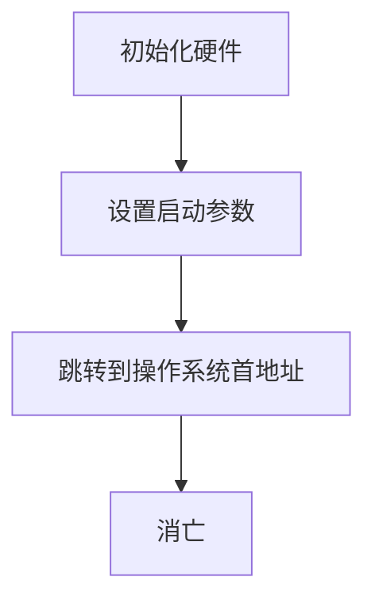
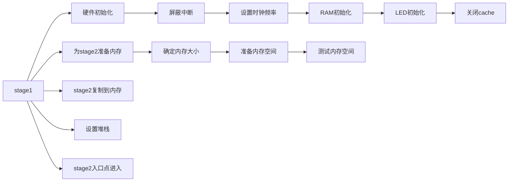
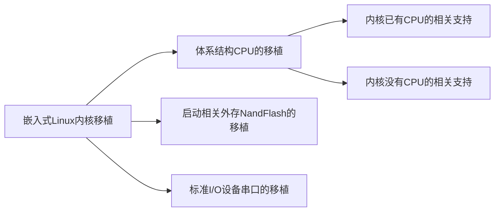

# 4-嵌入式Linux开发环境

## 4.1 主机Linux开发环境

10月7日

***

## 4.2 Bootloader

### 简介

#### BootLoader的存储

- 不同处理器组成的计算机系统都规定了启动后执行的第一条指令的地址
- 嵌入式系统通常把固态存储设备(如ROM或FLASH等)映射到这个地址上，把Bootloader放在这里，这样启动时，首先执行的就是Bootloader
- 例如：
    - 51系列单片：100h
    - 8086处理器：FFFF:0000
    - ARM处理器：0x00000000

#### BootLoader的输出

- 主机和目标机之间**一般通过串口建立物理连接**，没有串口的主机需要通过一条**USB转串口**的电缆完成连接
- Bootloader执行时**通常会将串口作为其标准输入输出设备**，输出打印提示信息到串口，从串口读取用户控制字符等
- 串口的参数要事先约定，一般多为115200（波特率），n，8，1

### 工作流程

一般分为两个阶段执行：

1. stage1为汇编语言编写，**初始化硬件**
2. stage2为C语言编写，**为操作系统做准备**

#### BootLoader的生命周期

##### stage1

- 弹簧床编程方式：todo

##### stage2

todo

##### BootLoader的2种操作模式

1. 启动加载（自主Autonomous）模式
2. 命令模式

### U-Boot（Universal BootLoader）

#### 基本介绍

- 占位
- 占位
- 占位
- 占位

#### 主要命令

- 打印环境变量：`printenv`
- 设置环境变量：`setenv`
- 保存环境变量：`saveenv`

## 4.3 嵌入式Linux内核

### 基本介绍

- linux内核主要由5个子系统组成：
    - 进程调度
    - 内存管理
    - 虚拟文件系统
    - 网络接口
    - 进程间通信
- 一般在Linux系统中的/usr/src/linux-\*.\*.\*目录下就是内核源代码
- Linux内核代码可以分为平台相关部分和平台无关部分，绝大部分代码是平台无关的
- 依赖于硬件的代码在Linux中采用条件编译的方式区分(makefile中)
    - ARCH=x86 台式计算机x86平台
    - ARCH=arm 嵌入式系统arm平台
- 嵌入式Linux开发有时要编写或移植内核中的代码，这种编程有一些限制，主要有：
    1. 内核中没有标准C库支持
    2. 内核中没有象用户程序那样的内存保护
    3. 内核中不便使用浮点操作
    4. 内核的堆栈是固定大小的，并且比较有限
    5. 在内核中需要编程者考虑并发带来的竞争与冒险，以及同步问题

### 4.3.1 源码目录

10月12日，4-3PPT8页

***

### 4.3.2 内核移植

### 4.3.3 配置编译

### 4.3.4 配置选项

10月14日

***

## 4.4 嵌入式Linux根文件系统

### 4.4.1 Linux文件系统

#### 简介

#### mount命令

#### 文件类型

- 普通文件
- 目录文件
- 设备文件
- 链接文件

##### 目录文件

- 目录文件包含的数据是文件名、子目录名以及指向它们的指针
- 目录文件是存储文件名的唯一地方，可以把文件和目录对应起来
- 每个文件都对应一个唯一的数值，叫做索引节点号，它指向的索引节点包含文件的所有信息
- Linux文件系统把**索引节点号1**赋于根目录
- Linux通过操作目录文件来实现对整个文件系统的操作

##### 设备文件

- Linux把设备当作文件来进行操作，大大方便了用户的使用
- 与设备相关的文件一般放在`/dev`目录下，主要包括两种，一种是块设备文件，另一种是字符设备文件
    - 块设备文件对应数据的读写**以块(如由柱面和扇区编址的块)为单位**的设备，最简单的如硬盘(`/dev/hda1`)等
    - 字符设备主要是指**串行端口**等接口设备

##### 硬链接与软链接文件

- 软链接又叫符号链接，软链接文件的**主要内容是另一个文件的路径名**。可以可以指向不同文件系统的任意文件或目录
- **一个文件名**和**一个索引节点**形成了对应关系，称为这个**索引节点的一个硬链接**，即硬链接只是指向一个文件索引节点的**指针**，等同于原文件
- 硬链接**节省空间**，是Linux系统整合文件系统的传统方式，**不可以**在**不同文件系统的文件间建立链接**，而且**只有超级用户**才可以为目录创建硬链接

##### 硬链接与软链接的区别

- 硬链接原文件和链接文件公用一个索引节点号，是同一个文件，而软链接原文件和链接文件拥有不同的索引节点号，是两个不同的文件
- 在文件属性上软链接明确写出了是链接文件，而硬链接等同于原文件
- 硬链接数目可以增加，软链接不会
- 硬链接文件显示的大小跟原文件一样，软链接显示的大小与原文件不同
- 相关命令：
    - 建立软链接：`ln [-s] source_path target_path`
    - 建立硬链接：`ln -d existfile newfile`

#### 文件系统类型（台式计算机）

- `EXT2`：GNU/Linux系统中标准的文件系统，**存取文件的性能极好**，**适于处理中小型的文件**，**支持16TB文件系统和2TB文件**。
- `EXT3`：Ext3是Ext2的下一代，加上了日志功能，是一个**日志文件系统(Journal File System)**，即会将整个磁盘的写入动作完整记录在磁盘的某个区域上，以便有需要时可以回溯追踪。
- `EXT4`：Ext3的改进版，可以提供更佳的性能和可靠性，还有更为丰富的功能，**支持 1EB的文件系统**，**以及 16TB 的文件**。
- `SWAP`：**专门用于交换分区的文件系统**，Linux使用整个分区来作为交换空间，而不像**Windows使用交换文件**，一般将这个交换分区的容量大小设为主存容量的2倍。

#### 虚拟文件系统VFS

- VFS(虚拟文件系统)**相当于文件系统中的“抽象基类”**，而一个的具体文件系统相当于这个抽象基类的“派生类”

- 对文件的open，write，read等操作在VFS中实现了一个类似于“**纯虚函数**”的接口，每种具体的文件系统，会使用其派生类中被“改写”的“虚函数”

- 文件操作时，VFS把操作映射到相关的物理文件系统

- VFS不是一个实际文件系统，**只是物理文件系统和服务之间的接口层**，它对文件系统的细节进行抽象，使不同文件系统在linux系统中看来是相同的

- **VFS只存在于内存中，在系统启动时建立，在系统关闭时消亡**

- VFS的主要功能是

    - 记录可用的文件系统类型
    - 把设备同对应的文件系统联系起来
    - 处理面向文件的通用操作

- 通过VFS，文件调用就可以面向用户界面**提供一个统一的编程接口**，在不同的文件系统上创建文件，而使用的函数或命令都是相同的

- Linux的文件系统主要分3块：

    

    - 上层文件系统的系统调用
    - VFS
    - 挂载到VFS中的各种实际的文件系统

### 4.4.2 Linux启动流程

TODO

### 4.4.3 嵌入式Linux文件系统

#### 发展

- 2000年，阿克斯(Axis)公司针对嵌入式系统中的Flash存储器发布了jffs日志文件系统
- 2001年初，Red Hat公司jffs基础上推出了jffs2文件系统，在节点头部中增加了CRC校验码和节点类型等新信息
- 目前这两种嵌入式文件系统已基本不再使用

#### 类型

- jffs/jffs2文件系统：针对早期小容量的nor flash和nand flash
- yaffs文件系统：针对 512 字节小页的小容量的nand flash
- yaffs2文件系统：针对大页的大容量的nand flash
- cramfs文件系统：存储嵌入式操作系统，只读，安全可靠
- ext3/4文件系统：针对大页的超大容量的eMMc存储器

#### YAFFS文件系统

- JFFS/JFFS2是针对Flash建立的文件系统，它可支持NOR和NAND Flash，但是把它应用于NAND Flash还存在如下问题：
    - JFFS需要通过建立在内存中的jffs_node结构体维护Flash中的日志节点，**每个节点需要占用48个字节的内存空间**
    - JFFS/JFFS2在挂载时需要扫描整个Flash的内容，以找出所有的日志节点，建立文件结构
- YAFFS（Yet Another Flash FileSystem）是专门针对NAND Flash特点编写的日志文件系统。它克服了JFFS/JFFS2的缺点，具有如下特性：
    - 很小的内存空间占用
    - 很短的挂载时间
    - 跨平台的文件系统

#### YAFFS2文件系统

#### CRAMFS文件系统

### 4.4.4 嵌入式Linux根文件系统

#### 简介

- **Linux启动时挂载的挂载点为根目录的文件系统，被称为根文件系统**，是存放运行、维护系统所必需的各种工具软件、库文件、脚本、配置文件和其它各种文件的地方，也可以安装各种软件包
- **根文件系统是所有Linuix系统中不可缺少的组件**，没有根文件系统，Linux系统就不能正确的运行
- 根文件系统的具体形式就是就是我们平时看到的linux目录
- 嵌入式系统中的根文件系统，nandflash常用cramfs，eMMC常用ext3/4

#### 主要目录

- `/bin`：包含了**引导启动所需的命令或普通用户可能用的命令**，这些命令都是二进制文件的可执行程序，都是重要的系统文件

- `/sbin`：类似`/bin`，也用于存储二进制文件。因为**其中的大部分文件都是系统管理员使用的基本的系统程序**，所以虽然普通用户必要且允许时可以使用，但一般不给普通用户使用

- `/dev`：**存放了设备文件，即设备驱动程序**，用户通过这些文件访问外部设备。比如，用户可以通过访问`/dev/mouse`来访问鼠标的输入，就像访问其他文件一样

- `/boot`：**存放引导加载器(bootloader)使用的文件**，如LILO、grub，内核映像也经常放在这里，而不是放在根目录中

- `/tmp`：存放程序在运行时产生的临时信息和数据

- `/mnt`： 是系统管理员临时挂载文件系统的挂载点

    - 系统并不自动支持挂载到/mnt ，要使用`mount`命令挂载
    - 可分为许多子目录，如
        - /mnt/dosa
        - /mnt/exta
        - /mnt/cdrom等

- 嵌入式Linux的根文件系统中，必须的目录有/bin,/dev,/etc,/lib,/proc,/sbin和/usr，其他目录都是可选的，目录中必须添加的内容包括：

    - 链接库

    - 配置文件

    - 内核模块

    - 设备文件

        TODO：此处应当有表格

    - 主要的系统应用程序

    - init程序

10月19日，PPT4-4 25页

***

## 4.5 基于imx6的嵌入式linux烧写

### 如何烧写

1. 复制烧写工具目录`mfgtools`……
2. 编译u-boot已经生成了文件：`u-boot.imx`，复制时要更名为u-boot-im……
3. 编译内核生成了文件：
    1. `zImage`
    2. `imx6dl-sabresd.dtb`，复制时要更名为zIma……
4. 生成根文件系统压缩包：`rootfs.tar.bz2`
5. 将拨码开关调整到`USB OTG`模式：`00001100`
6. 占位