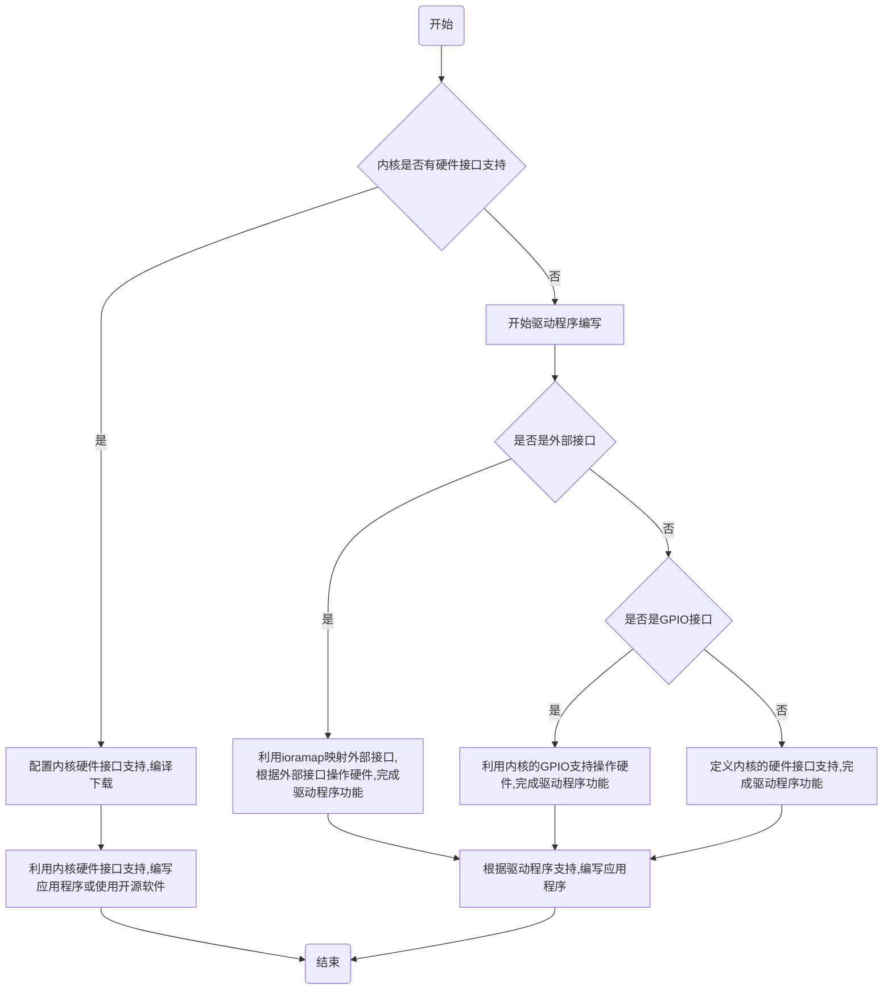
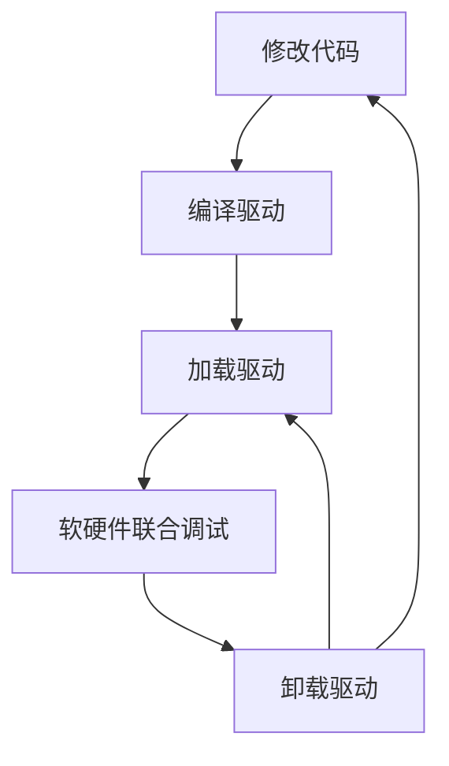

# 5-如何控制硬件



## 5.1 Linux驱动程序

### 5.1.1 Linux驱动程序概述

#### 分类：按照操作的设备

Linux驱动程序按它们操作的设备被分为三类，每一类设备的驱动程序都提供了通用的接口，供内核在需要请求它们的服务时加以使用，驱动程序使得内核能够用标准的方式操作各类设备

##### 字符设备

1. 基本介绍

    原意指那些只能按顺序一个字节一个字节读取的设备，但事实上一些高级的字符设备也可以从指定位置一次读取一块数据

    - 按字节访问
    - 顺序访问
    - 一般不使用缓存技术
    
2. 详细介绍

    - 占位
    - 占位

##### 块设备

1. 基本介绍

    指那些可以从任意位置读取任意长度数据的设备，它以块为单位进行处理，块的大小通常为 0.5KB 到 32KB

    - 按块访问
    - 随机访问
    - 常常采用缓存技术
    
2. 详细介绍

    - 占位
    - 与字符设备不同，**块设备拥有缓冲机制**，这代表，**对块设备的操作不一定会立刻引起**实际硬件的I/O
    - 块设备**主要是针对磁盘等慢速设备设计的**，可以避免耗费过多的CPU时间来等待

##### 网络设备

1. 基本介绍

    linux中一类比较特殊的设备，负责**接收和发送帧数据**，这些帧

    1. 可能是**物理帧**
    2. 也可能是**ip数据包**
    
2. 详细介绍

    - 占位

#### 应用程序与驱动程序

##### 应用程序

应用程序是一个**进程**

- 编程从**主函数main()**开始
- 主函数main()返回即是进程结束

##### 驱动程序

驱动程序是**一系列内核函数**

- 驱动程序包含了一些函数，是内核的一部分，如 open()、close()、read()、write()
- 这些函数由内核在适当的时候来调用
- 这些函数可以用来完成硬件访问等操作

#### 如何访问驱动程序

todo

#### 驱动程序加载

Linux驱动程序加载方式有2种：

1. 驱动程序**直接编译入内核**
    - 在内核启动时就已经在内存中
    - 可以保留专用存储器空间
        - 老师的理解：老师的一个学生使用Linux2.4内核，LCD显示驱动申请的缓冲区可能会被释放，会导致屏幕隔段时间闪一下
2. 驱动程序以模块形式存储在文件系统里，需要时**动态载入内核**
    - 按需加载，不用时节省内存
    - 相对独立于内核，升级灵活
    - 授权方式灵活

#### 驱动程序模块加载

- 加载时先调用函数`init_module()`，完成**设备初始化**，如寄存器置位、结构体赋值等
- 然后**注册设备**，**字符设备**和**块设备**分别调用`register_chrdev()`和`register_blkdev()`，获得**主次设备号**，并建立与文件系统关联
- 卸载时要回收资源、令寄存器复位并从系
    统中注销设备，字符和块设备分别调用
    unregister_chrdev()和unregister_blkdev()
- 操作设备通过系统调用完成，如open、
    read、write、ioctl等。


#### 模块形式的驱动程序开发流程



10月21日，PPT5 13页

***

### 5.1.2 Linux设备管理结构

#### 概述

- 内核常常使用**设备类型**、**主设备号**和**次设备号**来标识一个具体的设备
- 用户希望能**用同样的应用程序和命令来访问设备和普通文件**，为此Linux中的设备管理应用了设备文件这个概念来统一设备的访问接口
- 简单的说，系统试图使它对所有各类设备的输入、输出看起来就好像对普通文件的输入、输出一样
- 由于Linux中将设备当作文件来处理，所以对设备进行操作的系统调用和对文件操作的类似，主要包括`open()`、`read()`、`write()`、`ioctl()`、`close()`等
- 应用程序发出系统调用指令以后，会从用户态转换到内核态，通过内核将open()这样的系统调用转换成对物理设备的操作

#### 主设备号和次设备号

- 设备管理中，除了设备类型(字符设备或块设备)以外，内核还需要一对称做**主、次设备号**的参数，才能唯一表示设备
- **主设备号**(`major number`)：**相同的设备使用相同的驱动程序**，系统**依靠主设备号标识不同的驱动程序**，可通过`/proc/devices`看到。内核代码中的相关说明在`documentation/devices.txt`中
- **次设备号**(`minor number`)：用来**区分同一驱动程序的具体设备实例**
- 2.4内核中**主、次设备号**都为**8位**，2.6以后的内核扩展为**12位和20位**
- 例如，第一IDE接口上的所有磁盘及其分区共用同一主设备号3，而次设备号则为0，1，2，3 …

#### 命名习惯

- Linux习惯上将设备文件放在目录/dev或其子目录之下。
- 设备文件命名通常由两部分组成，规则为：
    - 第一部分**通常较短**，可能只有2或3个字母组成，用来表示设备大类。例如，**普通硬盘如IDE接口的为”hd”，软盘为”fd”，U盘为”sd”**
    - 第二部分**通常为数字或字母**用来**区别设备实例**
- 例如：
    - `/dev/hda、/dev/hdb、/dev/hdc`表示第一、二、三块**硬盘**
    - `dev/hda1、/dev/hda2、/dev/hda3`则表示第一硬盘的第一、二、三**分区**

### 5.1.3 Linux驱动程序开发基础

#### 基本功能

1. **对设备初始化和释放**：如对音频设备而言包括向内核注册设备，设置音频初始的输入输出参数 (如采样频率、采样宽度等)、分配音频设备使用的内核内存等工作
2. **对设备进行管理**：包括实时参数设置以及提供对设备的操作接口（可以理解为**控制总线**）
3. **读取应用程序传送给设备文件的数据并回送应用程序请求的数据**：这需要在用户空间、内核空间、总线及外设之间传输数据（可以理解为**数据总线**）
4. **检测和处理设备出现的错误**（可以理解为**状态总线**）

#### 工作过程

- 下面的论述针对的是字符设备驱动程序的一般情况，目的是帮助我们理解和开发自己的字符设备驱动程序
- 对于linux内核封装的复杂的tty和控制台等设备的驱动程序，虽然也属于字符设备，但一般都属于内核开发人员的工作，本处不做进一步介绍
- 下面从创建字符设备文件、打开字符设备文件和读写字符设备三个方面进行论述

##### 创建字符设备

- 创建了字符设备文件，就可以在**/dev目录**下看到它和使用它了
- Linux下可以用**mknod命令**(前面有例子)或者**函数(devfs、udev和device_create等函数)**创建
- 创建文件在linux内部使用了**mknod()系统调用**，**内核实现函数是sys_mknod**
- **sys_mknod调用vfs_mknod**，然后调用当前文件系统相关函数(如ext2_mknod)创建文件

##### 打开字符设备文件

- 用户进程使用**open()系统调用**打开字符设备文件
- **open()系统调用**使用的**内核函数为sys_open**，它首先**申请一个未使用的文件句柄**，然后**调用flip_open()函数**
- flip_open创建一个与文件句柄号对应的**struct file结构体**，并对其进行初始化及设置，然后调用**chrdev_open()**
- **chrdev_open()函数**根据**字符设备开关表**找到并调用对应的***_open()函数(如果函数存在的话)

##### 读写字符设备文件

- 用户进程分别用read()和write()系统调用读写字符设备中的数据
- read()和write()系统调用分别使用内核函数sys_read()和sys_write()函数，sys_read()和sys_write()函数再分别调用vfs_read()和vfs_write()函数
- 最后根据字符设备开关表找到并调用对应的\*\*\*\_read()和\*\*\*_write函数(如果函数存在的话)

##### file_operations结构体

###### 简介

- 在Linux系统内部，I/O设备的存/取通过一组固定的入口点来进行，这组入口点是由每个设备的设备驱动程序提
    供的
- 具体来说，设备驱动程序所提供的这组入口点由一个文件操作结构来向系统进行说明
- file_operations结构定义于linux/fs.h文件中，随着内核的不断升级，file_operations 结构也越来越大，不同版本的内核会稍有不同
- 下面是3.14.28版本的file_operations

###### 代码

```c
struct file_operations
{
	struct module *owner;
	loff_t (*llseek) (struct file *, loff_t, int);
	ssize_t (*read) (struct file *, char __user *, size_t, loff_t *);
	ssize_t (*write) (struct file *, const char __user *, size_t, loff_t *);
	ssize_t (*aio_read) (struct kiocb *, const struct iovec *, unsigned long, loff_t);
	ssize_t (*aio_write) (struct kiocb *, const struct iovec *, unsigned long, loff_t);
	int (*iterate) (struct file *, struct dir_context *);
	unsigned int (*poll) (struct file *, struct poll_table_struct *);
    long (*unlocked_ioctl) (struct file *, unsigned int, unsigned long);
    long (*compat_ioctl) (struct file *, unsigned int, unsigned long);
    int (*mmap) (struct file *, struct vm_area_struct *);
    int (*open) (struct inode *, struct file *);
    int (*flush) (struct file *, fl_owner_t id);
    int (*release) (struct inode *, struct file *);
    int (*fsync) (struct file *, loff_t, loff_t, int datasync);
    int (*aio_fsync) (struct kiocb *, int datasync);
    int (*fasync) (int, struct file *, int);
    int (*lock) (struct file *, int, struct file_lock *);
    ssize_t (*sendpage) (struct file *, struct page *, int, size_t, loff_t *, int);
    unsigned long (*get_unmapped_area) (struct file *, unsigned long, unsigned long, unsigned long, unsigned long);
    int (*check_flags )(int);
    int (*flock) (struct file *, int, struct file_lock *);
    ssize_t (*splice_write) (struct pipe_inode_info *, struct file *, loff_t *, size_t, unsigned int);
    ssize_t (*splice_read) (struct file *, loff_t *, struct pipe_inode_info *, size_t, unsigned int);
    int (*setlease) (struct file *, long, struct file_lock **);
    long (*fallocate) (struct file * file, int mode, loff_t offset, loff_t len);
    int (*show_fdinfo) (struct seq_file * m, struct file * f);
};

```

###### 成员介绍

- `owner` ——module 的拥有者
- `llseek` ——重新定位读写位置，修改设备的当前读写位置，并返回新的读写位置
- `read` ——从设备中读取数据，需要提供字符串指针
- `write` ——向字符设备中写入数据，需要提供所写内容指针
- `readdir `——只用于文件系统，对设备无用
- `ioctl `——控制设备，用户进程可发送命令获取设备信息、控制设备操作方式或参数
- `mmap `——将设备内存映射到进程地址空间，通常只用于块设备
- `open `——**打开设备并初始化设备**，为其创建文件结构对象，分配文件句柄
- `flush `——清除内容，一般只用于网络文件系统中
- `release `——**关闭设备文件**，释放文件结构对象和文件句柄，**与open相反**
- `fsync` ——实现内存与设备的同步，如将内存数据写入硬盘
- `fasync `——实现内存与设备之间的异步通讯，根据FASYNC标志变化进行通信
- `lock `——文件锁定，用于文件共享时的互斥访问
- `readv `——在进行读操作前要验证地址是否可读
- `writev `——在进行写操作前要验证地址是否可写
- `select`——进行选择操作（编写驱动程序时选择功能）
- `poll`——检查设备读写操作是否会被阻塞，返回一个掩码字，每一位都代表某种操作

###### 进一步的介绍

todo

### 5.1.4 Linux驱动程序编写

以一个虚拟的驱动程序为例讲解

#### 功能

- 实现虚拟设备的写入、读出等操作。这个驱动程序并不基于特定硬件设备的，实际上仅仅是对内存进行读、写操作
- 当执行写入操作时，将会对特定的存储空间进行写入；当执行读出操作时，将会对该存储空间进行数据的读取；同时还可以利用ioctl进行清除该存储空间的操作
- 这个mydrv设备的实现文件是mydrv.c，其中的文件接口flle_operations{}提供了mydrv_read、mydrv_write、mydrv_ioctl函数：
    1. 函数`mydrv_read()`的功能是从mybuf[100]中**读取字符串**，并传递给调用的进程
    2. 函数`mydrv_write()`的功能是**将调用的进程传入的字符串赋值给mybuf**，如果字符串的长度超过100，则只取前100个字符
    3. 函数`mydrv_ioctl()`中仅仅实现了一个控制功能：**清除mybuf存储区**

#### 具体实现

- 首先，要根据设备功能的需要，**编写file_operations结构中的操作函数**
- 其次，要向系统**注册该设备**，主要包括字符设备的注册（也可包括dev目录下文件节点的注册，若包括就不需要用mknod建立文件节点了）。然后就可以利用对应的文件进行设备操控了

##### 源码

```c
#include <linux/module.h>
#include <linux/init.h>
#include <linux/kernel.h> /* printk() */
#include <linux/slab.h> /* kmalloc() */
#include <linux/fs.h> /* everything... */
#include <linux/errno.h> /* error codes */
#include <linux/types.h> /* size_t */
#include <linux/proc_fs.h>
#include <linux/fcntl.h> /* O_ACCMODE */
#include <linux/poll.h> /* copy_to_user */
#include <asm-arm/system.h> /* cli(), *_flags */
#include <linux/cdev.h>
#include <asm-arm/arch/regs-gpio.h>
#include <asm-arm/hardware.h>
#include <asm-arm/io.h> /*writel,readl*/

// 定义常量和变量
#define MYDRV_CLS 1 // 定义清存储区命令字
char mybuf[100]; // 存储区域
int mydrv_major = 99; // 主设备
struct cdev* mydrv_cdev;
dev_t mydrv_dev;

struct file_operations mydrv_ops = 
{
	owner: THIS_MODULE,
	read: mydrv_read,
	write: mydrv_write,
	ioctl: mydrv_ioctl,
};

// 第一步：编写 file_operations 函数
ssize_t mydrv_read(struct file* filp, char* buf, size_t count, loff_t* f_pos);
static ssize_t mydrv_write(struct file* filp, const char * buf, size_t count, loff_t* ppos);
static int mydrv_ioctl(struct inode* inode, struct file* file, unsigned int cmd, unsigned long arg);

// mydrv_read()将内核空间的mybuf中的字符串赋给用户空间的buf区
// flip：指向设备文件的指针，f_pos：偏移量
ssize_t mydrv_read(struct file* flip, char* buf, size_t count, loff_t* f_pos)
{
    // 忽略大于100的部分
    if (count > 100)
    {
        count = 100;
    }
    // 从内核区复制到用户区，mybuf -> buf
    if (copy_to_user(buf, mybuf, count))
    {
        printk("error reading, copy_to_user\n");
        return -EFAULT;
    }
    return count;
}

// mydrv_write()将用户空间的buf字符串赋给内核空间的mybuf[]数组中
static sszie_t mydrv_write(struct file* flip, const char* buf, size_t count, loff_t* ppos)
{
    int num;
    num = count < 100 ? count : 100;
    // buf -> mybuf
    if (copy_from_user(mybuf, buf, num))
    {
        return -EFAULT;
    }
    printk("mydrv_write succeed!\n");
    return num;
}

static int mydrv_ioctl(struct inode* inode, struct file* file, unsigned int cmd, unsigned long arg)
{
	// MYDRV-CLS 则清除 mybuf 数组内容
    switch(cmd)
    {
        case MYDRV_CLS:
            // 将mybuf数组的第一个元素赋值为'\0'，即将缓冲区内容清空
        	mybuf[0] = 0x0;
        	return 0;
        default:
        	return -EINVAL;
    }
}

// 指定模块 init 和 exit 函数
module_init(mydrv_init);
module_exit(mydrv_exit);

// 第二步：向系统注册该设备(2.6以后的注册方式)
int mydrv_init(void)
{
    int result;
    // printk是linux内核调用
    printk("initing...\n");
    // 将主设备号和次设备号合并为一个设备号
    mydrv_dev = MKDEV(mydrv_major, 0);
    // 分配一个字符设备设备号
	result = register_chrdev_region(mydrv_dev, 1, "mydrv");
    // 为这个字符设备分配空间
    mydrv_cdev = cdev_alloc();
    if (mydrv_cdev == NULL)
    {
    	printk(KERN_WARNING"Register cdev error\n");
    	return -1;
    }
    else
    {
        // 分配一个字符设备结构体
        cdev_init(mydrv_cdev, &mydrv_ops);
        // 初始化
        mydrv_cdev->ops = &mydrv_ops;
        mydrv_cdev->owner = THIS_MODULE;
        // 添加到字符设备开关表中
        if(cdev_add(mydrv_cdev, mydrv_dev, 1))
        {
            printk(KERN_WARNING"Add cdev error\n");
        }
    }
}

// 注销设备
void mydrv_exit(void)
{
    cdev_del(mydrv_cdev);
    unregister_chrdev_region(mydrv_dev, 1);
    printk("exiting...\n");
}

// GPL许可声明
MODULE_LICENSE("GPL");

```

##### 编译和安装

- 驱动程序编译和编译应用程序的方式是不同的，因为它不是可执行程序，编译一般建有`makefile`文件，使用`make`编译
- 如果没有出错的话，将会在本目录下生成一个`mydrv.ko`（2.6以后拓展名使用`ko`）文件
- 模块操作必须是以**root身份**进行的(或用命令su转换成root身份)，模块的加载操作命令：`#insmod mydrv.ko`
- 如果模块已经过调试，想直接加入内核的话，可以通过**修改内核使用的Kconfig和makefile文件来完成**
- 下面要为设备添加文件节点，主设备号99，次设备号0：`#mknod mydrv c 99 0`
- 此时就可以对设备进行读、写、ioctl等操作了
- 当不再需要对设备进行操作时，可以采用下面的命令卸载模块：`#rmmod mydrv`
- 要列出已加载模块，可以使用：`#lsmod`

##### 调用驱动程序的应用程序

```c
#include <stdio.h>

int main()
{
    int fp;
    char buf[100];
    if((fp = open("/dev/mydrv", 0)) < 0)
    {
        printf("Could not opened!\n");
        return -1;
    }
    else
    {
		printf("File open ok!\n");
    }
    read(fp, buf, sizeof(buf));
    printf("the buffer content is: %s\n", buf);
    printf("Please input ( < 100): ");
    scanf("%s", buf);
    write(fp, buf, sizeof(buf));
    read(fp, buf, sizeof(buf));
    printf("the buffer content is: %s\n", buf);
    ioctl(fp, 1, 0);
    read(fp, buf, sizeof(buf));
    printf("the buffer content is: %s\n", buf);
    close(fp);
    return 0;
}

```

#### makefile

```makefile
# 指出应用程序名
TARGET = test_demo

# 编译相关变量定义
CROSS_COMPILE = arm-poky-linux-gnueabi-
CC = $(CROSS_COMPILE)gcc
CFLAGS = -march=armv7-a -mthumb-interwork -mfloat-abi=hard -mfpu=neon -mtune=cortex-a9  --sysroot=/opt/poky/1.7/sysroots/cortexa9hf-vfp-neon-poky-linux-gnueabi
ifneq ($(KERNELRELEASE),)
	# 指定驱动程序名字
	obj-m := mydrv.o
else
	# 指定内核目录
    KERNELDIR ?= /imx6/up-imx6/UP-CUP-IMX6/SRC/kernel/IOT-IMX6-linux-3.14.28/
    PWD := $(shell pwd)

# 指定2个目标
all: $(TARGET) modules
$(TARGET):
	# 编译应用程序命令
	$(CC) $(CFLAGS) -o $(TARGET) $(TARGET).c
modules:
	# 编译驱动程序命令
	$(MAKE) -C $(KERNELDIR) M=$(PWD) modules
.PHYON: modules clean
clean:
	# 清除编译痕迹
	rm -rf *.o *.ko .*.cmd *.mod.c .tmp.versions $(TARGET)
endif

```

#### 常用函数

##### `cdev_alloc`

##### `cdev_init`

##### `cdev_add`和`cdev_del`

##### 手动分配和释放设备号

##### 自动分配设备号

##### 设备号相关宏

##### 其他函数

- 用户空间和内核空间传递数据
    - `copy_to_user`
    - `copy_from_user`
- 说明模块加载和卸载时执行的函数
    - `module_init`
    - `module_exit`
- `printk`、`kmalloc`和`kfree`：内核程序不能使用`printf、malloc和free`，这3个函数替代其功能

10月26日，PPT5.1.4和5.1.5 15页

***

#### 中断使用

- 中断服务程序，又称为驱动程序的下半部。在Linux系统中**并不是直接**从中断向量表调用设备驱动程序的中断服务子程序，而是由Linux系统来接收硬件中断，再由内核调用中断服务子程序

### 5.1.5 LED驱动程序实验讲解

以LED控制为例，编写程序控制5个LED灯，代码分为两个部分：

1. 控制LED的驱动程序
2. 调用驱动程序的应用程序

#### 可配置的引脚

#### 驱动程序实验

PPT31页新增内容


## 5.2 串行设备编程

### 5.2.1 Linux串口命令

- 串口设备是物联网最常用的设备，嵌入式Linux的串口命令为`stty`
- 查看串口参数的命令为：`stty -F /dev/ttymxc0 –a`
- 设定串口一参数为`115200,n,8,1`的命令为：`stty -F /dev/ttymxc0 speed 115200 cs8 -parenb -cstopb`
- 查看串口接收数据的命令为：`cat /dev/ttymxc0`
- 向串口发送数据的命令为：`echo "abcdefg"t > /dev/ttymxc0`

### 5.2.2 试验箱中的串口

- 实验箱Linux上使用的IMX6的四个串口设备名字为：

    - `/dev/ttymxc0`
    - `/dev/ttymxc1`
    - `/dev/ttymxc3`
    - `/dev/ttymxc4`

    其中`/dev/ttymxc0`为**Linux控制台使用**，可以在`uboot`参数中设置

    其中在试验箱的`RS232-3`没有焊接接口，实际上也是不可用的

10月28日，PPT5-2，12页

***

### 5.2.3 内核的串口支持


### 5.2.4 串口程序设计流程

### 5.2.5 串口程序具体设计

- 串口发送数据比较慢，需要等待的时间比较长，但是接收会快一些，可以少等一会

### 5.2.6 USB摄像头

